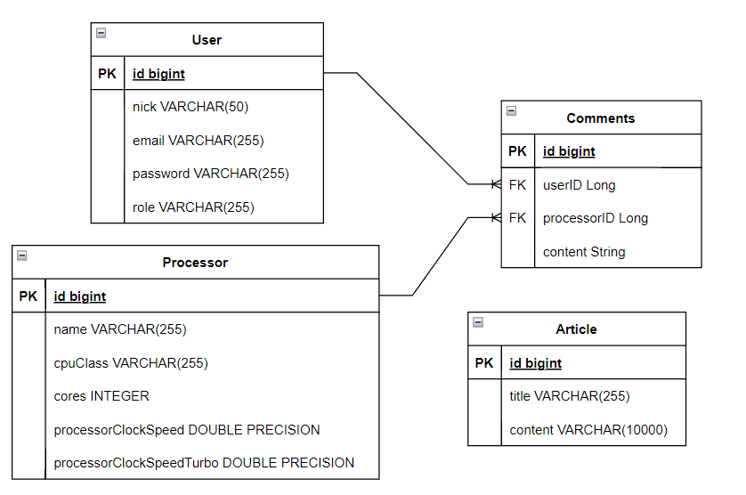
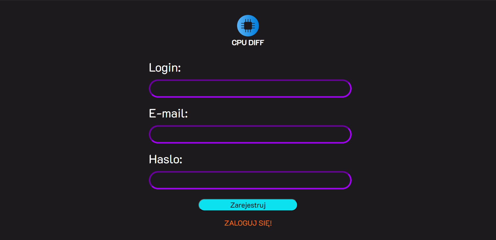
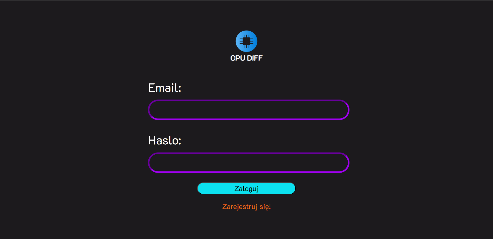
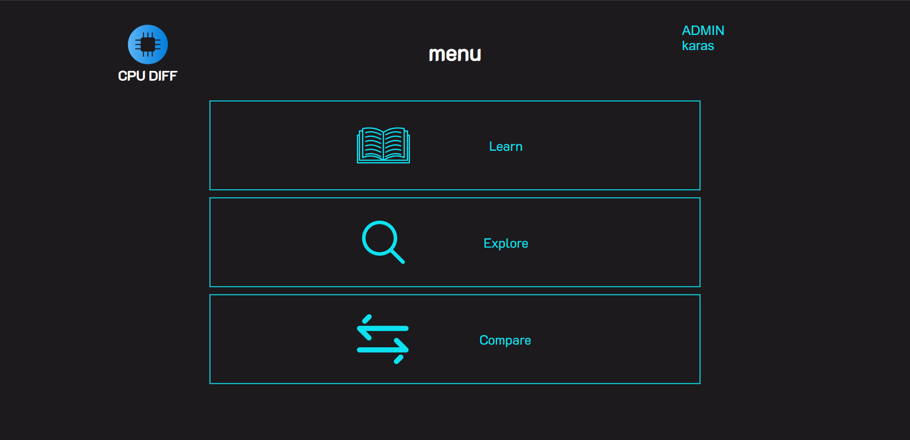
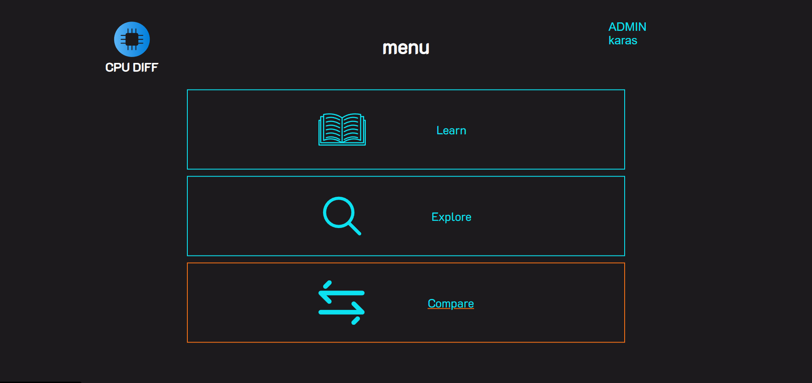
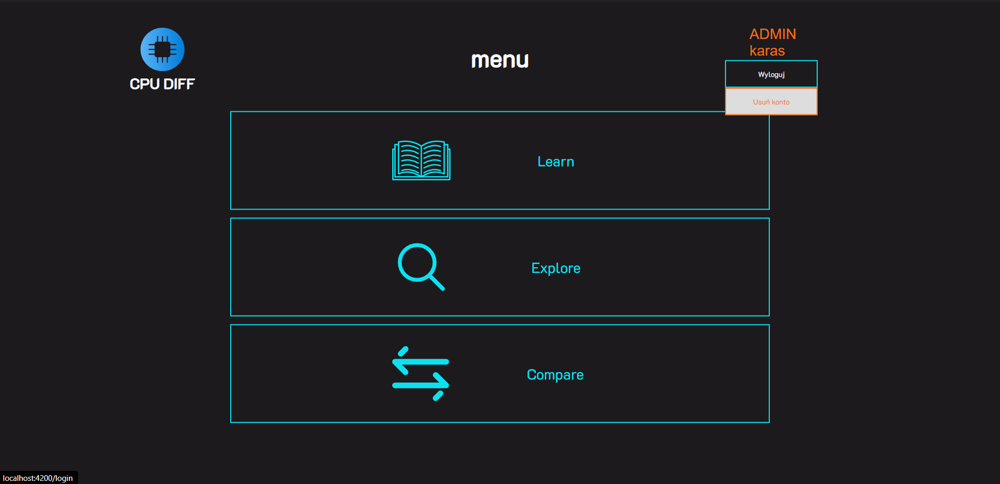
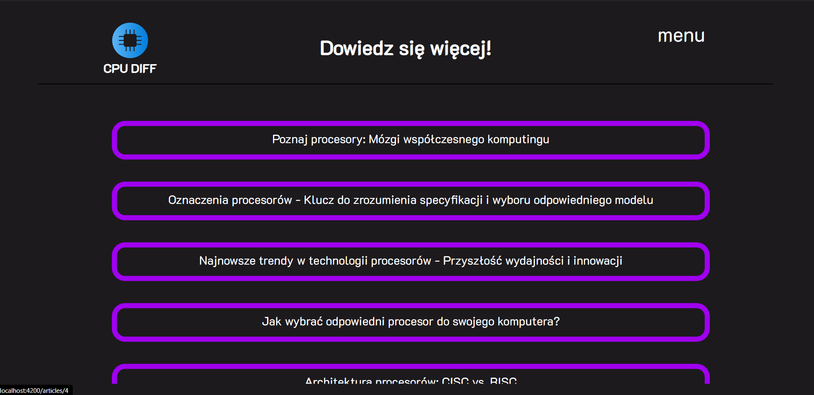
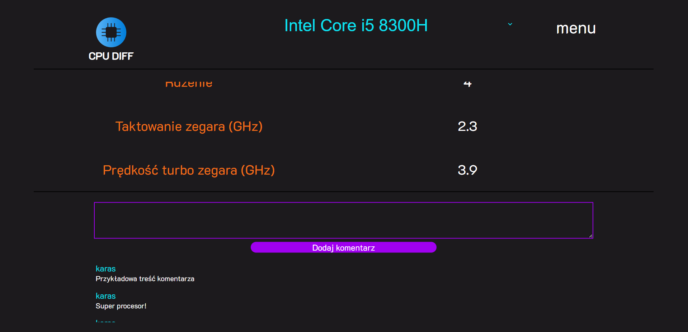
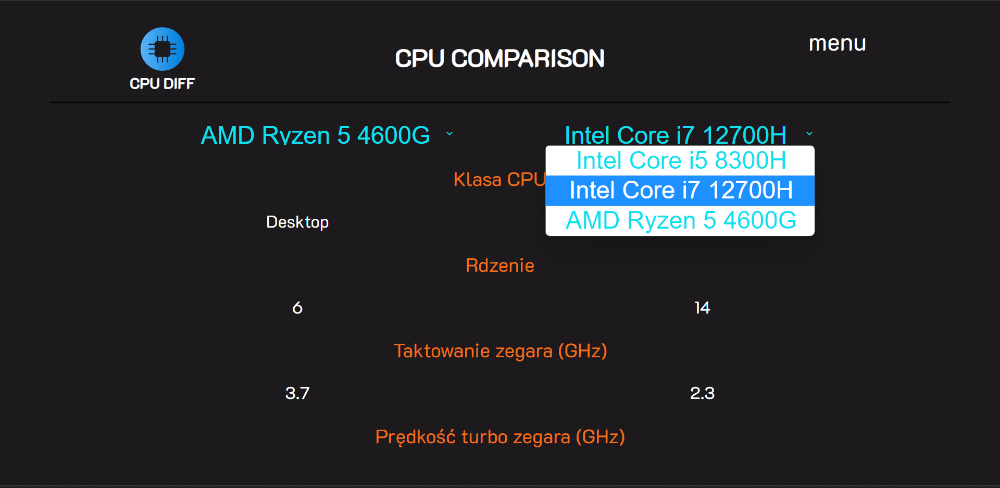

  

# CPUDIFF

My web application is a platform that allows users to compare processors, comment on them, and read articles about processors.

# Technologies
- Angular/TS
- Java (Spring Boot / Hibernate)
- HTML/CSS
- PostgreSQL

# Requirements
- [Docker](https://www.docker.com/)
- [Angular](https://angular.io/)
- [Node.js](https://nodejs.org/en)

# Database

#Screenshots

 - register
    
 - login
   
 - menu
   
   
   
 - articles
   
 - processor
   
 - comparison
   